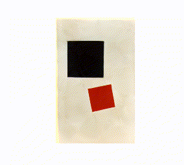

# Получение перехода от одной картинке к другой

     

### Just for FUN
Решил попробовать повторить один проект, который увидел в интернете.    
Первая нейросеть запоминает один рисунок.   
Вторая нейросеть запоминает второй рисунок.    
Затем постепенно меняем веса первой нейросети так, что бы они, за заданное количество шагов, они соответствовали весам второй и каждый шаг сохраняем картинку, которую генерирует нейросеть.    
### нейросеть
Три входных нейрона. На два нейрона подаются координаты (x,y) с картинки.    
Четыре скрытых слоя по 100 нейронов.    
На выходе 3 нейрона (**RGB**) определяют цвет пикселя

Этой нейросетью лучше запоминать простые рисунки.   
Они легко и быстро запоминаются.    
Для примера, я использовал картины Малевича

## Инструкция
Более подробно написано в коде.
### подбор картинок
Берём последовательность картинок, которые хотим использовать в переходе.  
Все картинки у меня сложенны в папке **pic/**. 
### обучение
Для обучения используется блокнот **learn.ipynb**         
Можно производить обучение на случайно сгенерированных весах, а можно переобучить копию существующей нейросети на новой картинке. Это даёт разные результаты во время генерации перехода между изображениями.     
   
Веса сохраняются в папке, которую указывает пользователь *(она должна существовать)*  

Обучение прекращается *"на глазок"*, когда изображение на выходе удовлетворяет вас.     
### создание перехода   
Для этого используется блокнот **transition.ipynb**    
Указываем размер изображений, которые хотим получить. Можно указывать размер значительно больше, чем размер исходных картинок.      
Затем прописываем последовательность переходов (*из какой картинки в какую и за сколько шагов*) и ждём результат в виде последовательности картинок в папке **result**       
Подробности расписанны в коде

## некоторые моменты
- Я сначало обучил нейросеть на картинке 0.png    
- Затем взял копию нейросети с предыдущего шага и переобучил на картинку 1.png 
- Затем взял копию нейросети с предыдущего шага и переобучил на картинку 2.png           
- и так далее

Предполагал, что только в последовательности 0-1-2-3-4-5-.... будет плавный переход между картинками.

Оказалось, что плавный переход возникает между любыми картинками этой серии.
